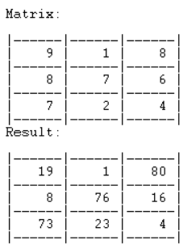

# Instruções de Execução: C-Note_2

Por forma a executar o programa basta utilizar o Sistema de Desenvolvimento SICStus Prolog, dando load ao ficheiro cnote.pl

## Execução dos predicados

Para obter a resolução de um problema, basta inserir no terminal do SICStus:

```
cnote(+Input, +RowLength, +Sum).
```

Em que *Input* é a grelha do problema, tratando-se de uma lista simples, *RowLength* é o tamanho das linhas/colunas e *Sum* a soma das colunas e linhas desejada.

Para gerar uma matriz que tem, de certeza, pelo menos uma solução, basta correr o predicado: 

```
cnoteGenerate(+Length, +Value, -PossibleMatrix).
```

### Notas

Para resolver, por exemplo, um problema com a grelha seguinte, o comando seria "cnote([9,1,8,8,7,6,7,2,4], 3, 100)."



